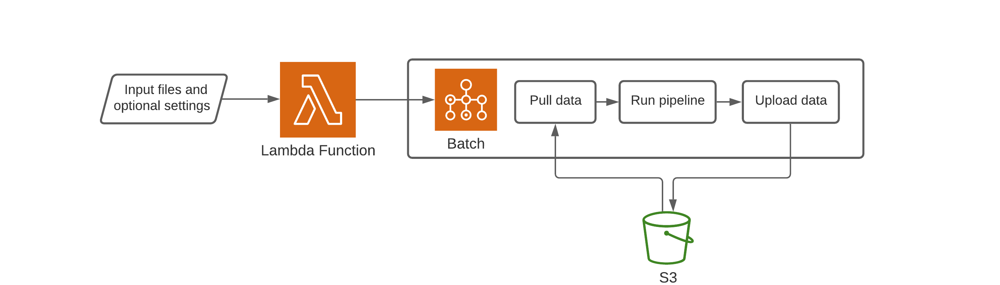

# GRIDSS/PURPLE/Linx pipeline stack
The AWS stack for running the GRIDSS/PURPLE/Linx (GPL) pipeline. Job orchestration and pipeline execution is handled by
Batch. Specifically, jobs are run on Batch-provisioned EC2 instances using a Docker container that includes the GPL pipeline,
a Python wrapper script, and all required dependencies. The wrapper [Python script](assets/run_gpl.py) pulls reference and
sample data, creates a configuration file, runs the GPL pipeline, and finally uploads results to S3.

The GPL pipeline runs entirely within a single EC2 instance rather than creating individual Batch jobs for each NF task and
sending them to multiple instances. This avoids having to pull reference data for each job, which can take up to 30 minutes.
This approach will continue to be the most suitable solution until Nextflow can utilise a shared filesystem between jobs
without using enterprise plugins.

When a run fails for any reason the wrapper Python script attempts to catch the terminating signal and upload all data
(including working directory) to the specified S3 output directory before exiting.

## Table of contents
* [Schematic](#schematic)
* [Prerequisites](#prerequisites)
* [Deployment](#deployment)
* [Usage](#usage)
* [Lambda arguments](#lambda-arguments)

## Schematic
<p align="center"></p>

## Prerequisites
It is assumed that the necessary VPC, security groups, and S3 buckets are appropriately deployed and configured in the target
AWS account.

## Deployment
The stack has some software requirements for deploy:
* AWS CDK Toolkit (available through Homebrew or npm)
* Docker
* Python3

### Create virtual environment
```bash
python3 -m venv .venv/
pip install -r requirements.txt
```

### Build Docker image
Configure
```bash
NAME=gpl-nf
VERSION=0.1.0
URI_LOCAL="${NAME}:${VERSION}"
AWS_PROVIDER_URL=843407916570.dkr.ecr.ap-southeast-2.amazonaws.com
AWS_URI_REMOTE="${AWS_PROVIDER_URL}/${NAME}:${VERSION}"
```

Build
```bash
docker build -t "${NAME}" -f assets/Dockerfile .
```

Upload
```bash
# Tag image with remote AWS ECR URI
docker tag "${NAME}" "${AWS_URI_REMOTE}"

# Configure Docker with AWS credentials and upload
aws ecr get-login-password --region ap-southeast-2 | docker login --username AWS --password-stdin "${AWS_PROVIDER_URL}"
docker push "${AWS_URI_REMOTE}"

# Remove unencrypted credentials
rm /Users/stephen/.docker/config.json
```

### Deploy stack
```bash
cdk deploy
```

## Usage
```bash
aws lambda invoke \
  --function-name gpl_job_submitter \
  --cli-binary-format raw-in-base64-out \
  --payload '{
      "job_name": "seqcii_smlv_annotation",
      "tumour_name": "SEQC-II_Tumor_50pc",
      "normal_name": "SEQC-II_Normal",
      "tumour_bam": "s3://bucket-name/key-prefix/SEQC-II_Tumor_50pc-ready.bam",
      "normal_bam": "s3://bucket-name/key-prefix/SEQC-II_Normal-ready.bam",
      "tumour_smlv_vcf": "s3://bucket-name/key-prefix/SEQC-II-50pc-ensemble-annotated.vcf.gz",
      "output_dir": "s3://bucket-name/key-prefix/output/"
    }' \
  response.json
```
>Some temporary requirements:
>* the `output_dir` parameter must be a 'subdirectory' of `s3://umccr-temp-dev/stephen/gpl_output/`

## Lambda arguments
| Argument                  | Description                                                                                                   |
| ---                       | ---                                                                                                           |
| `job_name`                | Name for Batch job. Must be ≤128 characters and match this regex `^\w[\w_-]*$`. [*optional*]                  |
| `normal_name`             | Normal sample name. Must match **exactly** the normal name as it appears in provided the VCFs [*required*]    |
| `tumour_name`             | Tumour sample name. Must match **exactly** the tumour name as it appears in provided the VCFs [*required*]    |
| `tumour_bam`              | S3 path to normal BAM. Must be co-located with index. [*required*]                                            |
| `normal_bam`              | S3 path to tumour BAM. Must be co-located with index. [*required*]                                            |
| `tumour_smlv_vcf`         | S3 path to tumour small variant VCF. [*optional*]                                                             |
| `tumour_sv_vcf`           | S3 path to tumour SV VCF. GRIDSS fragment extraction automatically run if provided. [*optional*]              |
| `output_dir`              | S3 path to output directory. [*required*]                                                                     |
| `docker_image_tag`        | Specific Docker image to use e.g. 0.0.3 [*optional*]                                                          |
| `nextflow_args_str`       | Arguments to pass to Nextflow, must be wrapped in quotes e.g. "\"--mem_gridss 14G\"" [*optional*]             |
| `instance_memory`         | Instance memory to provision                                                                                  |
| `instance_vcpus`          | Instance vCPUs to provision. *Currently only accepting 8 vCPUs per job to avoid exceeding storage limits*     |
